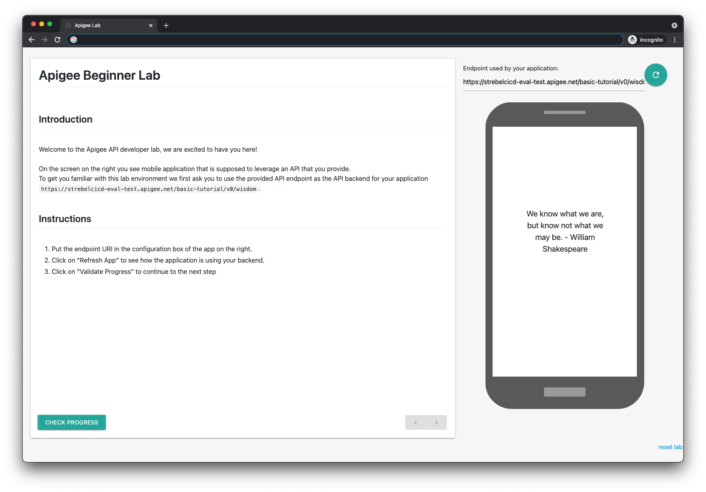

# Self-Study Tutorial UI

This UI Can be used together with Tutorial APIs e.g. [labs/self-study-tutorial-basic](../self-study-tutorial-basic).
For interactive, self-checking labs.

## Using the Student UI

1. Deploy a Tutorial API.
1. Visit the Github Pages [hosted](https://apigee.github.io/devrel/labs/.self-study-student-ui) version of this UI or host your own.
1. Copy the Base URI of the Tutorial API when prompted e.g. `https://APIGEE_ORG-APIGEE_ENV.apigee.net/basic-tutorial/v0`.
1. Enjoy learning about Apigee.

## Screenshot



## Development

```sh
npm run serve
```
